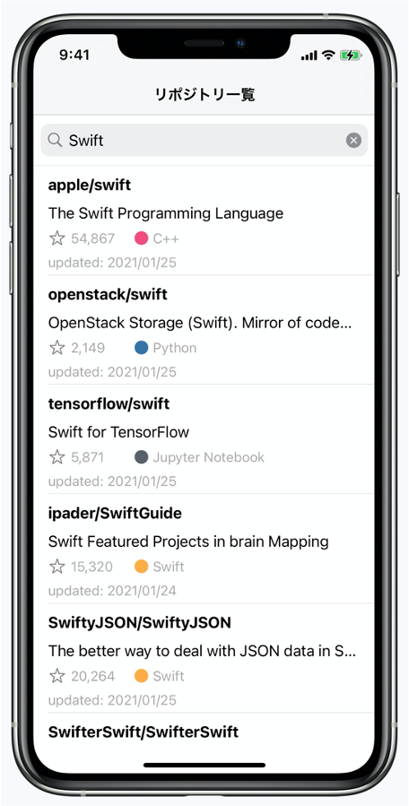
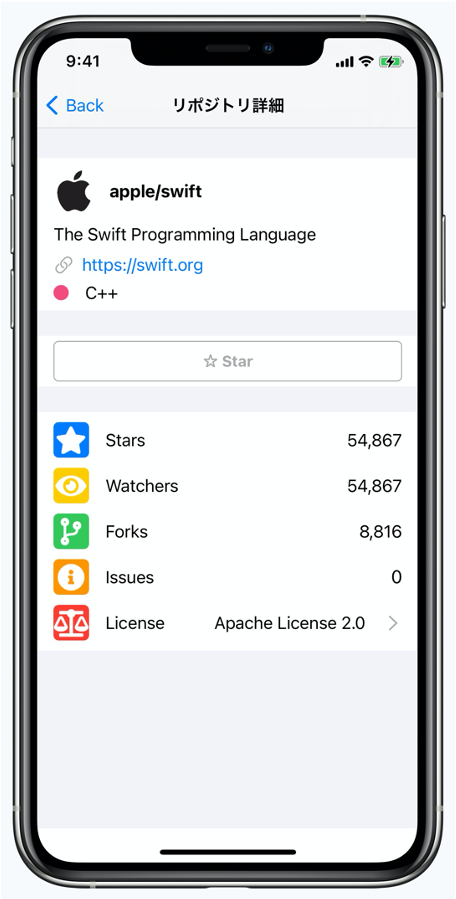
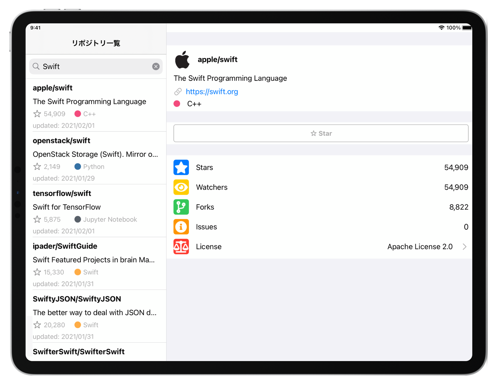

# Storyboardを使用せずにコードでViewを作成するサンプルアプリ

## 開発環境
- Xcode version 12.4
- Swift version 5.0
- pod version 1.9.3
- 開発ターゲット iOS 14.0

## 概要
- 本アプリは [ios-engineer-codecheck](https://github.com/shusuke0812/ios-engineer-codecheck) を元にStoryboardを使わずにコードのみでViewを作成したアプリである（GitHubRepositorySearchディレクトリ）
- UIKitを使用している

## UI概要
- GitHubのリポジトリを検索できるUI

| 検索前 | 検索後 | 詳細画面 |
|:-----:|:-----:|:-----:|
||||

| iPad |
|:----:|
||

## 参考
- 

## メモ
- 