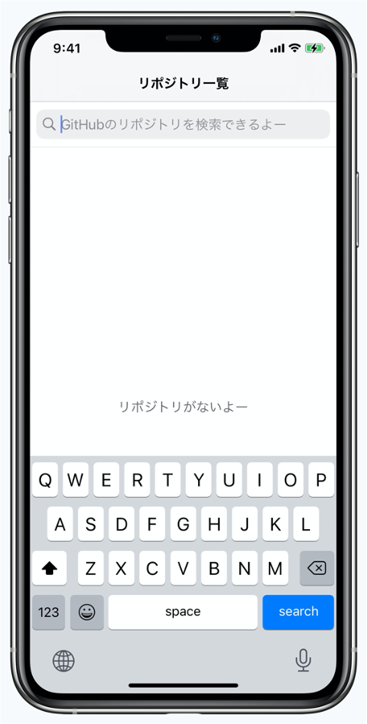

# Storyboardを使用せずにコードでViewを作成するサンプルアプリ

## 開発環境
- Xcode version 13.3.1
- Swift version 5.6
- pod version 1.11.3
- 開発ターゲット iOS 14.0

## 概要
- 本アプリはStoryboardを使わずにコードのみでViewを作成したアプリである
- サンプルコード
  - Exampleディレクトリ：`UIKit`を使用した例
  - GitHubSearchディレクトリ：`SwiftUI`を使用した例

## UI概要

### GitHubSearch UI

| 検索前 | 検索後 | 詳細画面 |
|:-----:|:-----:|:-----:|
||||

| iPad |
|:----:|
||

## 参考
- 

## メモ
- 